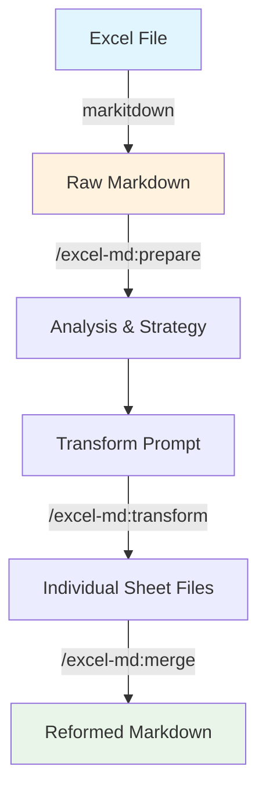

# Excel Markdown Reformatter

Excel方眼紙ファイルをMarkdownに変換し、読みやすい形式に再フォーマットするClaude Codeスラッシュコマンドセット

## Requirements

- markitdownライブラリ（Excelファイルの事前変換用）
- Claude Code環境

## 処理フロー



## Commands

### `/excel-md:prepare`
Excelファイルの準備と分析を行います。

### `/excel-md:transform`
個別シートを読みやすいMarkdownに変換します。

### `/excel-md:merge`
変換されたMarkdownファイルを統合し、最終的なドキュメントを生成します。


## Workflow

### Step 1: Excel → Markdown変換
```bash
# markitdownでExcelファイルをMarkdownに変換
markitdown your_excel_file.xlsx > your_excel_file.md
```

### Step 2: ファイル準備と分析
```bash
/excel-md:prepare your_excel_file.md
```
- ファイルの検証とシート構造解析
- 変換戦略の決定と並列処理方式の判定
- 変換用プロンプトファイル生成

### Step 3: シート変換
```bash
/excel-md:transform your_excel_file_transform_prompt.md
```
- 各シートを個別のMarkdownファイルに変換
- NaN値とUnnamed列の除去
- テーブル構造の整形と品質向上

### Step 4: ファイル統合
```bash
/excel-md:merge your_excel_file
```
- 変換されたシートファイルを統合
- 最終的な読みやすいドキュメント生成

## Output

- 変換用プロンプトファイル
- 各シート用の個別Markdownファイル
- 統合された最終ドキュメント
