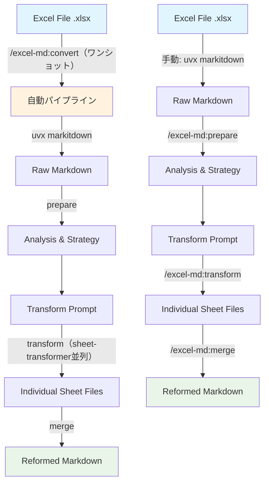

# Excel Markdown Reformatter

Excel方眼紙ファイルをMarkdownに変換し、読みやすい形式に再フォーマットするClaude Codeプラグイン

## Installation

### Claude Codeプラグインとしてインストール

```bash
claude plugin add https://github.com/takayama-kotaro/claude-excel-markdown-reformatter
```

### 前提条件

uv（Pythonパッケージマネージャ）が必要です。markitdownはuvx経由で一時実行されるため、事前インストール不要です。

```bash
# uvのインストール（未導入の場合）
curl -LsSf https://astral.sh/uv/install.sh | sh
```

## 処理フロー



## Commands

### `/excel-md:convert`（推奨）
.xlsxファイルをワンショットでMarkdownに変換します。markitdown変換からmergeまで全工程を自動実行します。

```bash
# 単一ファイル
/excel-md:convert report.xlsx

# 複数ファイル
/excel-md:convert file1.xlsx file2.xlsx

# ディレクトリ内の全xlsx
/excel-md:convert ./data/
```

### `/excel-md:prepare`
Excelファイルの準備と分析を行います。

### `/excel-md:transform`
個別シートをsheet-transformerサブエージェントで並列変換します。

### `/excel-md:merge`
変換されたMarkdownファイルを統合し、最終的なドキュメントを生成します。

## Agents

### sheet-transformer
シート変換専用のカスタムサブエージェント。markitdownで生成されたraw markdownの1シート分を受け取り、NaN除去・Unnamed列除去・テーブル整形を行い、整形済みmarkdownファイルとして保存します。

- 使用ツール: Read, Write, Glob
- モデル: sonnet（高速・低コスト）
- 並列実行: 最大5シート同時処理

transform処理時に自動的に呼び出されます。直接起動する必要はありません。

## Workflow

### ワンショット実行（推奨）
```bash
/excel-md:convert your_excel_file.xlsx
```
全工程が自動実行され、`your_excel_file_reformed.md` が生成されます。

### 個別ステップ実行（カスタム/デバッグ用）

#### Step 1: Excel → Markdown変換
```bash
uvx markitdown your_excel_file.xlsx > your_excel_file.md
```

#### Step 2: ファイル準備と分析
```bash
/excel-md:prepare your_excel_file.md
```
- ファイルの検証とシート構造解析
- 変換戦略の決定と並列処理方式の判定
- 変換用プロンプトファイル生成

#### Step 3: シート変換
```bash
/excel-md:transform your_excel_file_transform_prompt.md
```
- 各シートを個別のMarkdownファイルに変換
- NaN値とUnnamed列の除去
- テーブル構造の整形と品質向上

#### Step 4: ファイル統合

##### Pythonスクリプト版（推奨）
```bash
python "${CLAUDE_PLUGIN_ROOT}/scripts/merge_sheets.py" "your_excel_file"
```

大きなファイルの統合にはPythonスクリプト版を推奨します。スラッシュコマンド版では出力トークン上限エラーが発生する可能性があります。

##### スラッシュコマンド版
```bash
/excel-md:merge your_excel_file
```

共通機能:
- 変換されたシートファイル（`*_sheet_*.md`）を統合
- 最終ドキュメント（`*_reformed.md`）生成

## Output

- 最終ドキュメント: `{basename}_reformed.md`
- 変換用プロンプトファイル: `{basename}_transform_prompt.md`
- 各シート用の個別Markdownファイル: `{basename}_sheet_{番号}_{シート名}.md`
